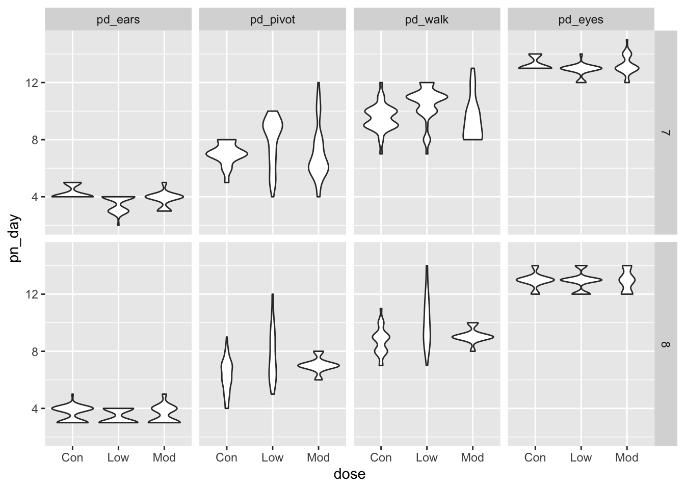

## create the weather data

```r
weather_df = 
  rnoaa:: meteo_pull_monitors(c("USW00094728", "USC00519397", "USS0023B17S"),
                      var = c("PRCP", "TMIN", "TMAX"), 
                      date_min = "2017-01-01",
                      date_max = "2017-12-31") %>%
  mutate(
    name = recode(id, USW00094728 = "CentralPark_NY", 
                      USC00519397 = "Waikiki_HA",
                      USS0023B17S = "Waterhole_WA"),
    tmin = tmin / 10,
    tmax = tmax / 10) %>%
  select(name, id, everything())
```

```
## Registered S3 method overwritten by 'crul':
##   method                 from
##   as.character.form_file httr
```

```
## Registered S3 method overwritten by 'hoardr':
##   method           from
##   print.cache_info httr
```

```
## file path:          /Users/dionna_attinson/Library/Caches/rnoaa/ghcnd/USW00094728.dly
```

```
## file last updated:  2019-09-26 10:27:41
```

```
## file min/max dates: 1869-01-01 / 2019-09-30
```

```
## file path:          /Users/dionna_attinson/Library/Caches/rnoaa/ghcnd/USC00519397.dly
```

```
## file last updated:  2019-09-26 10:27:57
```

```
## file min/max dates: 1965-01-01 / 2019-09-30
```

```
## file path:          /Users/dionna_attinson/Library/Caches/rnoaa/ghcnd/USS0023B17S.dly
```

```
## file last updated:  2019-09-26 10:28:02
```

```
## file min/max dates: 1999-09-01 / 2019-09-30
```

```r
weather_df
```

```
## # A tibble: 1,095 x 6
##    name           id          date        prcp  tmax  tmin
##    <chr>          <chr>       <date>     <dbl> <dbl> <dbl>
##  1 CentralPark_NY USW00094728 2017-01-01     0   8.9   4.4
##  2 CentralPark_NY USW00094728 2017-01-02    53   5     2.8
##  3 CentralPark_NY USW00094728 2017-01-03   147   6.1   3.9
##  4 CentralPark_NY USW00094728 2017-01-04     0  11.1   1.1
##  5 CentralPark_NY USW00094728 2017-01-05     0   1.1  -2.7
##  6 CentralPark_NY USW00094728 2017-01-06    13   0.6  -3.8
##  7 CentralPark_NY USW00094728 2017-01-07    81  -3.2  -6.6
##  8 CentralPark_NY USW00094728 2017-01-08     0  -3.8  -8.8
##  9 CentralPark_NY USW00094728 2017-01-09     0  -4.9  -9.9
## 10 CentralPark_NY USW00094728 2017-01-10     0   7.8  -6  
## # … with 1,085 more rows
```

## create a ggplot


```r
ggplot(weather_df, aes(x= tmin, y= tmax)) +
  geom_point()
```

```
## Warning: Removed 15 rows containing missing values (geom_point).
```


alternate way of making this plot 


```r
weather_df %>% 
  ggplot(aes(x= tmin, y = tmax)) +
  geom_point()
```

```
## Warning: Removed 15 rows containing missing values (geom_point).
```


saving initial plots 


```r
weather_df %>% filter(name == "CentralPark_NY")
```

```
## # A tibble: 365 x 6
##    name           id          date        prcp  tmax  tmin
##    <chr>          <chr>       <date>     <dbl> <dbl> <dbl>
##  1 CentralPark_NY USW00094728 2017-01-01     0   8.9   4.4
##  2 CentralPark_NY USW00094728 2017-01-02    53   5     2.8
##  3 CentralPark_NY USW00094728 2017-01-03   147   6.1   3.9
##  4 CentralPark_NY USW00094728 2017-01-04     0  11.1   1.1
##  5 CentralPark_NY USW00094728 2017-01-05     0   1.1  -2.7
##  6 CentralPark_NY USW00094728 2017-01-06    13   0.6  -3.8
##  7 CentralPark_NY USW00094728 2017-01-07    81  -3.2  -6.6
##  8 CentralPark_NY USW00094728 2017-01-08     0  -3.8  -8.8
##  9 CentralPark_NY USW00094728 2017-01-09     0  -4.9  -9.9
## 10 CentralPark_NY USW00094728 2017-01-10     0   7.8  -6  
## # … with 355 more rows
```


```r
scatterplot= 
  weather_df %>% 
  ggplot(aes(x= tmin, y= tmax)) +
  geom_point()

scatterplot
```

```
## Warning: Removed 15 rows containing missing values (geom_point).
```


adding color...


```r
weather_df %>% 
    ggplot(aes(x= tmin, y= tmax)) +
    geom_point(aes(color=name), alpha = .4)
```

```
## Warning: Removed 15 rows containing missing values (geom_point).
```


vs


```r
weather_df %>% 
    ggplot(aes(x = tmin, y= tmax, color = name)) + 
    geom_point(aes(color=name), alpha = .5) + 
    geom_smooth(se=FALSE)
```

```
## `geom_smooth()` using method = 'loess' and formula 'y ~ x'
```

```
## Warning: Removed 15 rows containing non-finite values (stat_smooth).
```

```
## Warning: Removed 15 rows containing missing values (geom_point).
```


facet!

```r
ggplot(weather_df, aes(x = tmin, y = tmax, color = name)) + 
  geom_point(alpha = .5) +
  geom_smooth(se = FALSE) + 
  facet_grid(. ~ name)
```

```
## `geom_smooth()` using method = 'loess' and formula 'y ~ x'
```

```
## Warning: Removed 15 rows containing non-finite values (stat_smooth).
```

```
## Warning: Removed 15 rows containing missing values (geom_point).
```


this is fine but not interesting 


```r
weather_df %>% 
  ggplot(aes(x = date, y = tmax, color = name)) +
  geom_point(aes(size=prcp), alpha = .5) +
  geom_smooth(size = 2, se = FALSE)
```

```
## `geom_smooth()` using method = 'loess' and formula 'y ~ x'
```

```
## Warning: Removed 3 rows containing non-finite values (stat_smooth).
```

```
## Warning: Removed 3 rows containing missing values (geom_point).
```


## Some extra stuff


```r
weather_df %>% 
  ggplot(aes(x = date, y = tmax, color = name)) +
  geom_smooth(size = 2, se = FALSE)
```

```
## `geom_smooth()` using method = 'loess' and formula 'y ~ x'
```

```
## Warning: Removed 3 rows containing non-finite values (stat_smooth).
```


2d density


```r
weather_df %>% 
  ggplot(aes(x = tmin, y = tmax)) +
  geom_bin2d() 
```

```
## Warning: Removed 15 rows containing non-finite values (stat_bin2d).
```


## More kinds of plots!! 

Understand the distribution of a single variable 


```r
weather_df %>% 
    ggplot(aes(x = tmax, fill = name)) +
    geom_histogram()
```

```
## `stat_bin()` using `bins = 30`. Pick better value with `binwidth`.
```

```
## Warning: Removed 3 rows containing non-finite values (stat_bin).
```


```r
weather_df %>% 
    ggplot(aes(x = tmax, fill = name)) +
    geom_histogram(position = "dodge")
```

```
## `stat_bin()` using `bins = 30`. Pick better value with `binwidth`.
```

```
## Warning: Removed 3 rows containing non-finite values (stat_bin).
```


```r
weather_df %>% 
    ggplot(aes(x = tmax, fill = name)) +
    geom_histogram(position = "dodge") +
    facet_grid(~name)
```

```
## `stat_bin()` using `bins = 30`. Pick better value with `binwidth`.
```

```
## Warning: Removed 3 rows containing non-finite values (stat_bin).
```


## A Density Plot 

```r
weather_df %>% 
    ggplot(aes(x = tmax, fill = name)) +
    geom_density(alpha = .3) 
```

```
## Warning: Removed 3 rows containing non-finite values (stat_density).
```


## A Box Plot

```r
weather_df %>% 
  ggplot(aes(x = name, y = tmax)) +
  geom_boxplot()
```

```
## Warning: Removed 3 rows containing non-finite values (stat_boxplot).
```


```r
weather_df %>% 
  ggplot(aes(x = name, y = tmax)) +
  geom_violin()
```

```
## Warning: Removed 3 rows containing non-finite values (stat_ydensity).
```


Ridge plots!!


```r
weather_df %>% 
  ggplot(aes(x= tmax, y= name)) + 
  geom_density_ridges()
```

```
## Picking joint bandwidth of 1.84
```

```
## Warning: Removed 3 rows containing non-finite values (stat_density_ridges).
```


##saving a plot 


```r
ggp_ridge_temp = 
  weather_df %>% 
  ggplot(aes(x = tmax, y = name)) + 
  geom_density_ridges()

ggsave("ggplot_temp_ridge.pdf", ggp_ridge_temp)
```

```
## Saving 7 x 5 in image
```

```
## Picking joint bandwidth of 1.84
```

```
## Warning: Removed 3 rows containing non-finite values (stat_density_ridges).
```


```r
weather_df %>% 
    ggplot(aes(x = tmin, y = tmax, color = name)) +
    geom_point(alpha = .4) + 
    geom_smooth(se = FALSE)
```

```
## `geom_smooth()` using method = 'loess' and formula 'y ~ x'
```

```
## Warning: Removed 15 rows containing non-finite values (stat_smooth).
```

```
## Warning: Removed 15 rows containing missing values (geom_point).
```


```r
weather_df %>% 
    ggplot(aes(x = tmin, y = tmax, color = name)) +
    geom_point(alpha = .4) + 
    geom_smooth(se = FALSE)
```

```
## `geom_smooth()` using method = 'loess' and formula 'y ~ x'
```

```
## Warning: Removed 15 rows containing non-finite values (stat_smooth).
```

```
## Warning: Removed 15 rows containing missing values (geom_point).
```


```r
weather_df %>% 
  ggplot(aes(x=tmin, y=tmax, color=name)) +
  geom_point(alpha = .5) +
  labs(
      title = "temperature plot",
      x = "minimum temp (c)",
      y = "maximum temp (c)", 
      caption = "Data from NOAA via rnoaa package"
  ) + 
  scale_x_continuous(
    breaks = c(-15, 0, 15), 
    labels = c("-15º C", "0", "15")
  ) +
  scale_y_continuous(
    trans = "sqrt", 
    position = "right")
```

```
## Warning in self$trans$transform(x): NaNs produced
```

```
## Warning: Transformation introduced infinite values in continuous y-axis
```

```
## Warning: Removed 90 rows containing missing values (geom_point).
```


## Color themes produced

```r
ggp_base = 
  weather_df %>% 
  ggplot(aes(x = tmin, y = tmax)) + 
  geom_point(aes(color = name), alpha = .5) + 
  labs(
    title = "Temperature plot",
    x = "Minimum daily temperature (C)",
    y = "Maxiumum daily temperature (C)",
    caption = "Data from the rnoaa package"
  ) + 
  viridis::scale_color_viridis(
    name = "Location", 
    discrete = TRUE)
ggp_base
```

```
## Warning: Removed 15 rows containing missing values (geom_point).
```


## Other themes 

```r
ggp_base + 
  theme_minimal() + 
  theme(legend.position="bottom")
```

```
## Warning: Removed 15 rows containing missing values (geom_point).
```


Where do my warnings come from...


```r
weather_df %>% 
  filter(is.na(tmin))
```

```
## # A tibble: 15 x 6
##    name       id          date        prcp  tmax  tmin
##    <chr>      <chr>       <date>     <dbl> <dbl> <dbl>
##  1 Waikiki_HA USC00519397 2017-04-17     5  28.3    NA
##  2 Waikiki_HA USC00519397 2017-05-09    NA  NA      NA
##  3 Waikiki_HA USC00519397 2017-05-26    NA  NA      NA
##  4 Waikiki_HA USC00519397 2017-07-19    NA  NA      NA
##  5 Waikiki_HA USC00519397 2017-10-07     0  31.1    NA
##  6 Waikiki_HA USC00519397 2017-10-09     0  28.9    NA
##  7 Waikiki_HA USC00519397 2017-10-10    10  31.7    NA
##  8 Waikiki_HA USC00519397 2017-10-12     0  31.1    NA
##  9 Waikiki_HA USC00519397 2017-10-13     0  31.1    NA
## 10 Waikiki_HA USC00519397 2017-10-16     5  30      NA
## 11 Waikiki_HA USC00519397 2017-10-18     0  29.4    NA
## 12 Waikiki_HA USC00519397 2017-10-20    13  30.6    NA
## 13 Waikiki_HA USC00519397 2017-10-21     0  30      NA
## 14 Waikiki_HA USC00519397 2017-10-22     0  30      NA
## 15 Waikiki_HA USC00519397 2017-12-22     0  26.7    NA
```

## more than one dataset


```r
central_park = 
  weather_df %>% 
  filter(name == "CentralPark_NY")

waikiki = 
  weather_df %>% 
  filter(name== "Waikiki_HA")

ggplot(data = waikiki, aes(x = date, y = tmax, color = name)) + 
  geom_point() + 
  geom_line(data = central_park)
```

```
## Warning: Removed 3 rows containing missing values (geom_point).
```


## Multi-panel Plots

```r
# install.packages("devtools")
devtools::install_github("thomasp85/patchwork")
```

```
## Skipping install of 'patchwork' from a github remote, the SHA1 (36b49187) has not changed since last install.
##   Use `force = TRUE` to force installation
```

```r
ggp_scatter = 
  weather_df %>% 
  ggplot(aes(x = tmin, y = tmax)) + 
  geom_point()

ggp_density = 
  weather_df %>% 
  ggplot(aes(x = tmin))+ 
  geom_density()

ggp_box = 
  weather_df %>% 
  ggplot(aes(x = name, y = tmax)) + 
  geom_boxplot()

(ggp_scatter + ggp_density) /ggp_box
```

```
## Warning: Removed 15 rows containing missing values (geom_point).
```

```
## Warning: Removed 15 rows containing non-finite values (stat_density).
```

```
## Warning: Removed 3 rows containing non-finite values (stat_boxplot).
```


## Data Manipulation
reorder function organizes data by size

```r
  weather_df %>% 
    mutate(
      name = factor(name),
      name = fct_reorder(name, tmax)
    ) %>% 
  ggplot(aes(x = name, y = tmax, color = name)) + 
  geom_boxplot()
```

```
## Warning: Removed 3 rows containing non-finite values (stat_boxplot).
```


```r
pup_data = 
  read_csv("./data/FAS_pups.csv", col_types = "ciiiii") %>%
  janitor::clean_names() %>%
  mutate(sex = recode(sex, `1` = "male", `2` = "female")) 

litter_data = 
  read_csv("./data/FAS_litters.csv", col_types = "ccddiiii") %>%
  janitor::clean_names() %>%
  select(-pups_survive) %>%
  separate(group, into = c("dose", "day_of_tx"), sep = 3) %>%
  mutate(wt_gain = gd18_weight - gd0_weight,
         day_of_tx = as.numeric(day_of_tx))

fas_data = left_join(pup_data, litter_data, by = "litter_number") 

fas_data %>% 
  select(sex, dose, day_of_tx, pd_ears:pd_walk) %>% 
  pivot_longer(
    pd_ears:pd_walk,
    names_to = "outcome", 
    values_to = "pn_day") %>% 
    drop_na(dose, day_of_tx, pn_day) %>% 
  mutate(
    outcome = factor (outcome),
    outcome = fct_reorder(outcome, pn_day)
  ) %>%
  mutate(outcome = forcats::fct_reorder(outcome, day_of_tx, median)) %>% 
  ggplot(aes(x = dose, y = pn_day)) + 
  geom_violin() + 
  facet_grid(day_of_tx ~ outcome)
```


